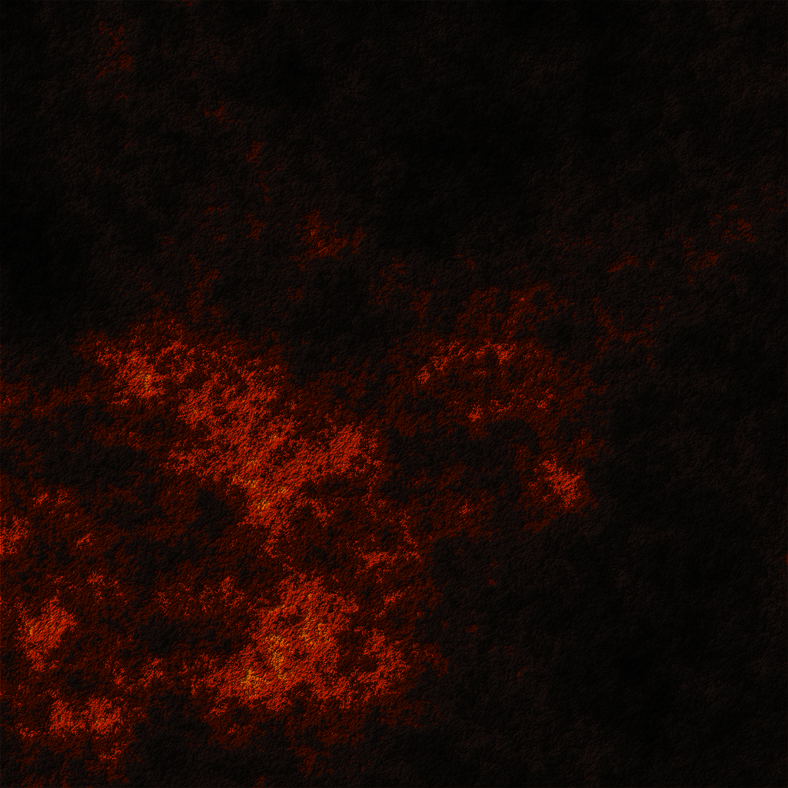
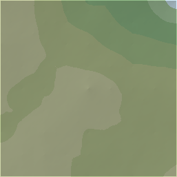
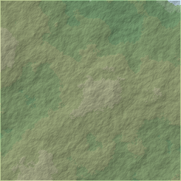
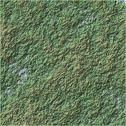
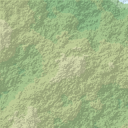
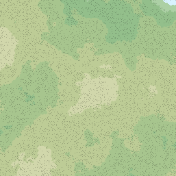

# Terreno-de-Mustafar
Projeto de geração procedural e exibição de terreno para a disciplina de Introdução às Técnicas de Programação do curso de Ciência da Computação na UFRN.
Este projeto usa o algoritmo Diamond-Square para criar mapas de altitude, mapeia cores a partir de arquivos de paleta e aplica diferentes algoritmos de sombreamento para realçar a topografia.

---
## Backstory real
Na semana passada, Vader nos ligou para dizer que decidiu decorar os corredores vazios de sua fortaleza com fotografias do terreno de Mustafar. Contudo, a atmosfera nublada e repleta de fuligem do planeta não nos permitiria tirar fotografias satelitais muito limpas. Claro, nós não queríamos decepcionar Lord Vader (por razões óbvias), então pensamos em uma alternativa: usar imagens geradas artificialmente. Eu honestamente não acho que ele vai desconfiar de algo.

---

*Terreno 1025x1025 com rugosidade 0.84, paleta de Mustafar(pallete.6txt) e sombreamento por gradiente.*

---
## Comparação de resultados
### Comparação do impacto da rugosidade
*Parâmetros fixos: tamanho 257x257, paleta `palette.txt`, fator sombra 0.8, escala sombra 5, método Gradiente.*

|      Rugosidade 0.3      |     Rugosidade 0.56      |     Rugosidade 0.8      |
| :----------------------: | :----------------------: | :---------------------: |
|  |  |  |

### Comparação dos métodos de sombreamento
*Parâmetros fixos: tamanho 257x257, paleta `palette.txt`, fator sombra 0.8, escala sombra 5, rugosidade 0.56.*

| Método Vizinho NW | Método Vizinhos Adjacentes | Método Gradiente |
| ----------------- | -------------------------- | ---------------- |
|        |       |   |
